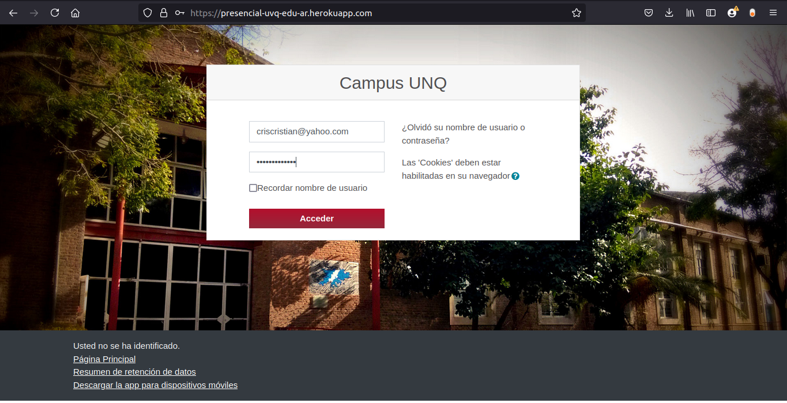
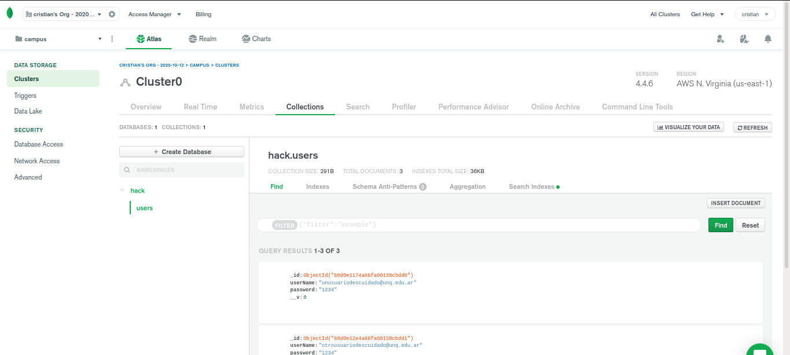
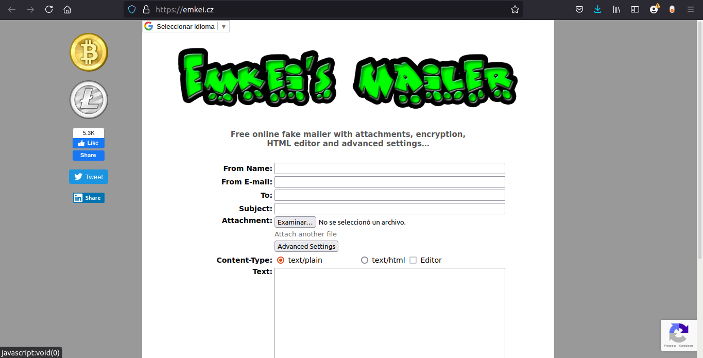

# Phishing

_Como parte del trabajo practico para la materia seguridad de la informacion - universidad nacional de Quilmes_

## Datos del proyecto :wrench:

_A continuacion la URL del sitio deployado y una captura de imagen del sitio web falso._

**https://presencial-uvq-edu-ar.herokuapp.com/**

_Los datos de autenticacion capturados se almacenan en la nube._

_Para enviar el correo suplantando la identidad del sender utilizamos un servicio web._

Autores :black_nib:

    Camila Arciniega
    Nelson Gonzalez
    Angelo Padrón
    Cristian Gonzalez
